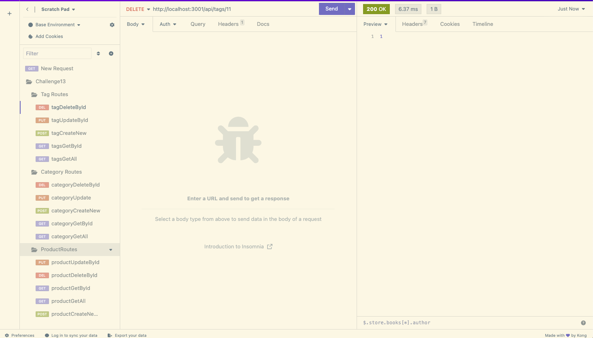

# E-Commerce-Back-End

E-commerce sites are rapidly increasing across the web. Managers at retail companies need technologies that keep their website competitive. 

## Installation 🖥️
To install the e-commerce back end, git clone the repository onto your local machine. Run 'npm i' in the terminal to download the libraries needed to run this app. Then create the database in MySQL Workbench based off the schema.sql file in the db directory. Once the database is created, run "npm run seed" to seed the data into the database. Once the database is seeded, the end points for testing are commented out above each route in the category-routes.js, product-routes.js, and tag-routes.js. The post and put routes will need JSON objects with the correct parameters entered into Insomnia. 

## Usage 📸

#
[Screen Recording Link](https://drive.google.com/file/d/1ATF3w4BKjiiVNHBg6mC_O_Ymt2WR7mjg/view)

## Credits 💳
I worked on this project alone, but received source code from the University of Denver Coding Bootcamp curriculum department, and their affiliate programmers. 

## License 🪪
This project is not licensed. 

## Features 📝
- View all, view one, create one, update one, or delete one category. If a category is deleted, it's referenced products will also be deleted.
- View all, view one, create one, update one, or delete one product. When a product is viewed, it's referenced tags are shown as well. 
- View all, view one, create one, update one, or delete one tag. 

## How to Contribute 🤝🏼

If you would like to contribute to this project, please contact the creator via LinkedIn: [Lillian Edwards](https://www.linkedin.com/in/lillian-edwards63/)

## Tests 🧪
There are no tests on this application at this time.  